# MERN eCommerce

### Deployed Site Link : [MERN eCommerce](https://mern-ecommerce-omega.vercel.app/)

 

### This eCommerce site has been created using the following technologies:

1. **Next.js** : Used for Both Frontend and Backend.
1. **Redux** : Used to manage and consume client state.
1. **TailwindCSS** : Used to style the frontend.
1. **Typescript** : Used to type check the code.
1. **JWT** : Used for authorization of users.
1. **React Hot Toast** : For displaying Toast Notifications.

 

# Some Screenshots:

## Desktop

---

 

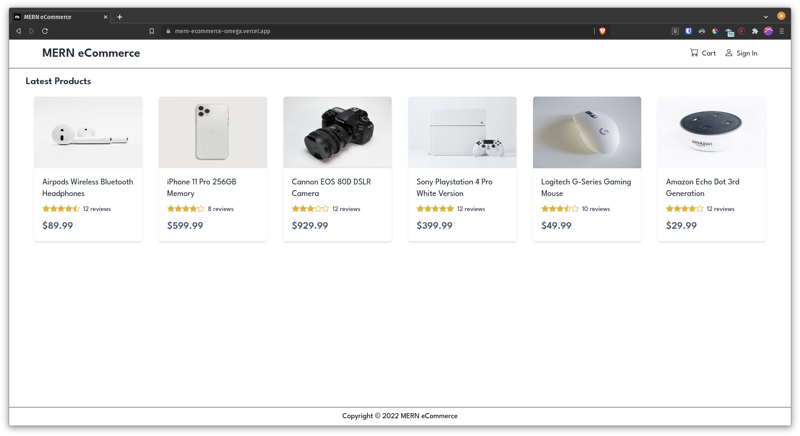

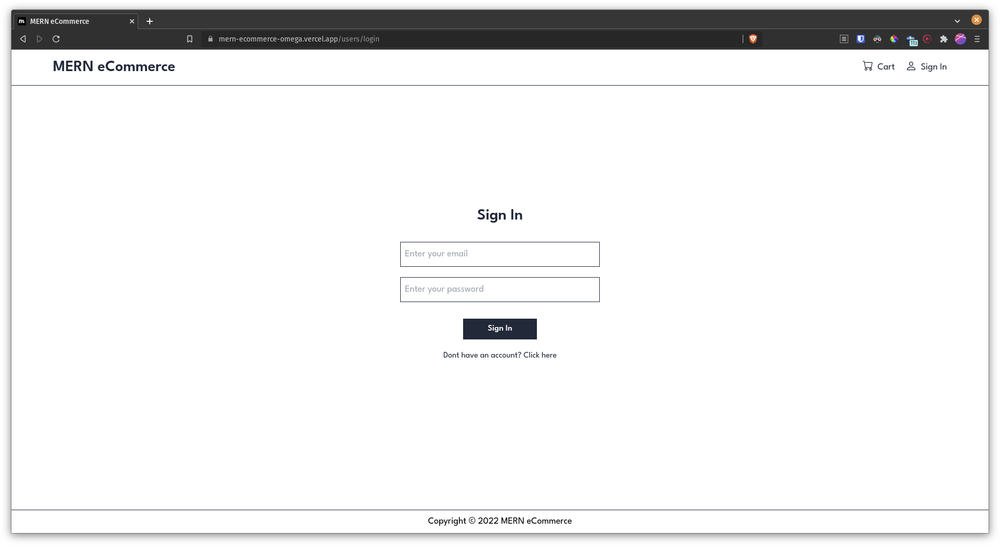

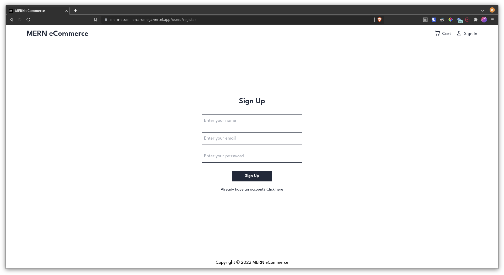

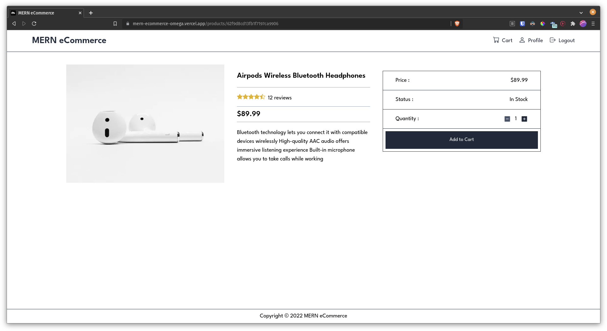

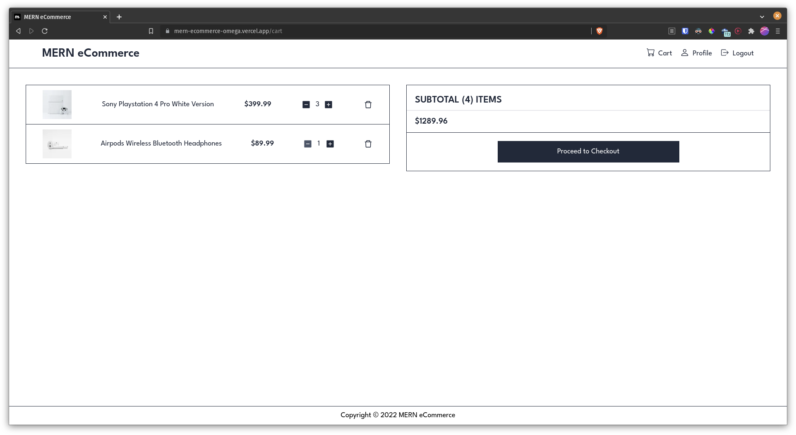

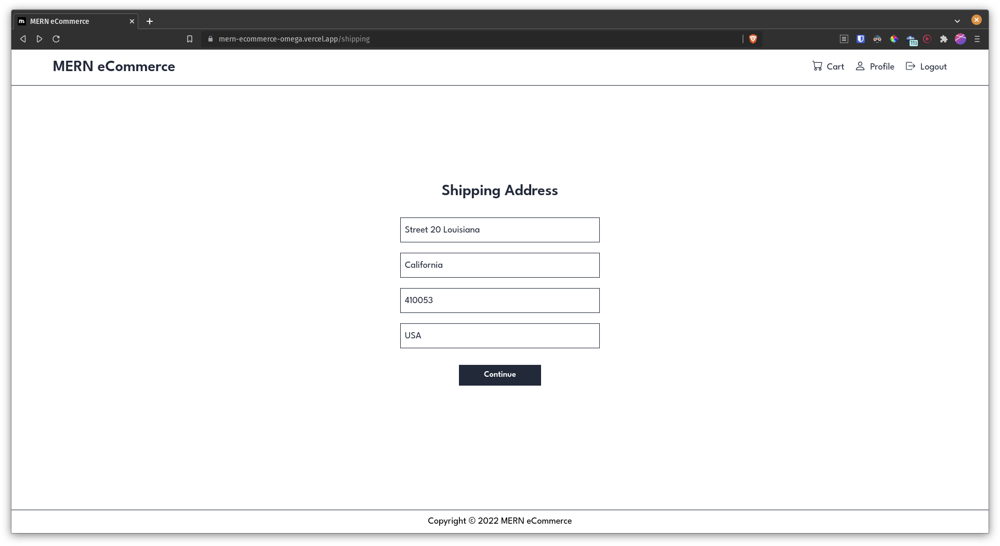

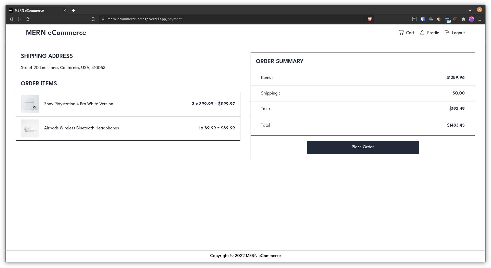

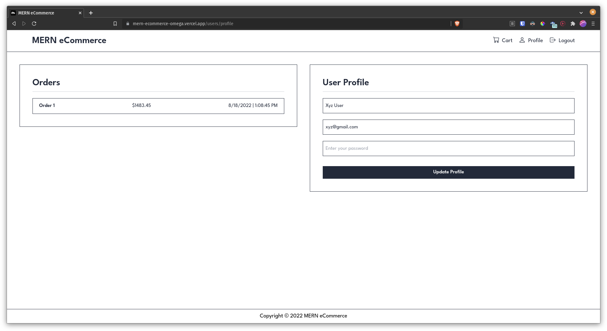

## Mobile

---

 

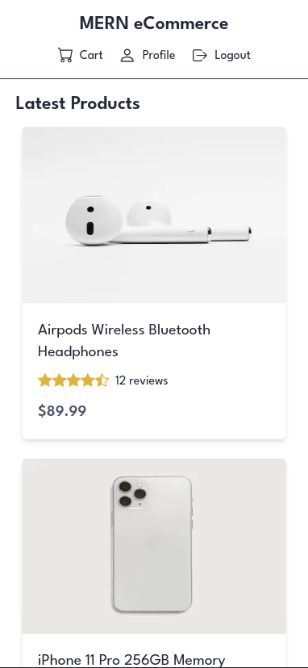

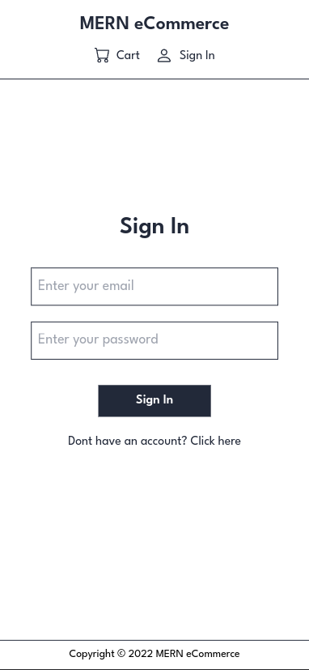

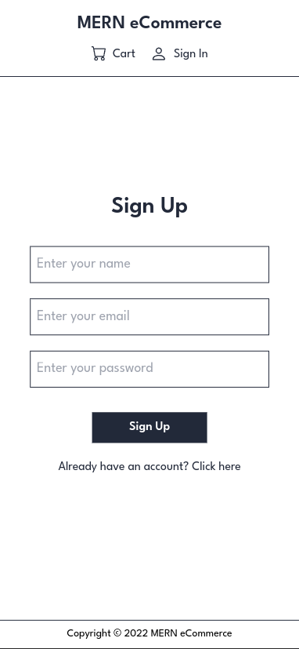

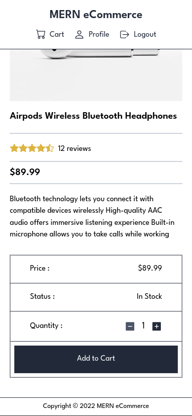

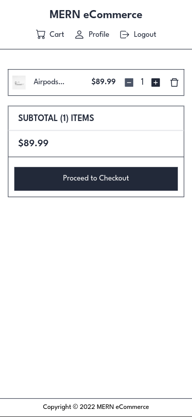

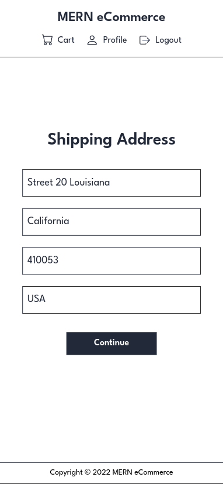

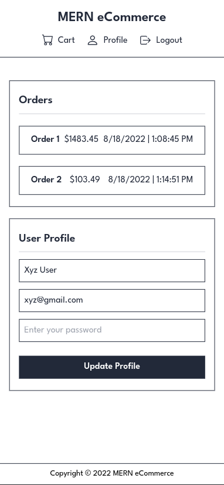
